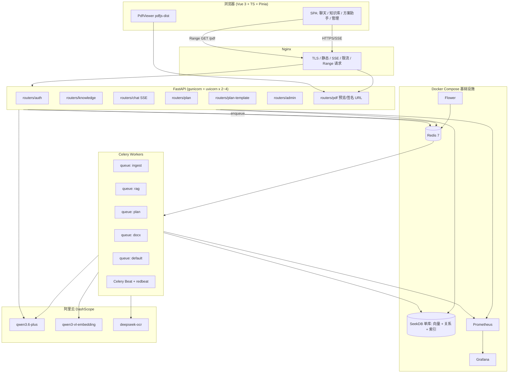

# ZhongMei RAG 终极重构方案（全新开发版）

> **目标规模**：20 人级并发（峰值 ≈ 30 RPS，同时在线 SSE 会话 ≤ 20，后台入库/文档生成任务 ≤ 8 并发）。
> **前置条件**：旧版本已下线，全新开发，不做历史数据/接口兼容，不做灰度切流。
> **本次迭代重点**：
>
> 1. **RAG 答复"可溯源、可点开 PDF 定位高亮"** —— 引用元数据细化到文档/章节/页/坐标，前端提供"跳转预览"按钮。
> 2. **施工方案助手重构为"施工方案智能编制平台"** —— 按 [施工文档AI生成产品最终方案.md](file:///E:/ZhongMeiRagProject/summary_opus/ultimate-plan.md) 的理念：**工程参数结构化表单 + 章节级 RAG + 多 Agent 协同 + Word 模板高保真渲染 + 一致性校验**；复用统一知识库（历史方案、规范、图纸、清单）与现有 RAG 技术栈。
> 3. **开发路线图细化** —— 10 个大阶段，每个大阶段内拆 2~5 个小阶段，给出详细任务清单与验收标准。
>
> **技术栈强约束（已锁定）**：
>
> - **LLM**：阿里 DashScope `qwen3.6-plus`（兼容 OpenAI 协议）
> - **Embedding**：阿里 DashScope `qwen3-vl-embedding`（多模态，1024 维）
> - **PDF/OCR**：阿里 `deepseek-ocr` API
> - **Agent**：LangGraph（全链路）
> - **数据层**：**SeekDB 单库**（关系 + 向量 + 稀疏全文索引一体化）
> - **方案文档生成**：**python-docx + docxtpl + 甲方 `custom-reference.docx` 模板直写**（摒弃 Markdown → Quarto → docx）
> - **后端**：Python 3.11 + FastAPI + Uvicorn + Celery + Redis
> - **部署**：Docker Compose（本地一体化）

---

## 1. 前端技术选型推荐

| 维度 | 选型 | 理由 |
|------|------|------|
| 框架 | **Vue 3.5 + `<script setup>` + Composition API** | 团队已有积累 |
| 语言 | **TypeScript 5.x（strict）** | 约束 API 形状 |
| 构建 | **Vite 7** | HMR 秒级 |
| 路由 | **Vue Router 4.5** + meta 权限守卫 + 布局嵌套 | 类型化 route meta |
| 状态管理 | **Pinia 2 + pinia-plugin-persistedstate** | `auth/user/kb/chat/plan/ui` |
| UI 组件 | **Element Plus 2.x** | 管理端 CRUD/表格/表单最快 |
| 图标 | **unplugin-icons + @iconify/vue** | 按需取 Iconify 图标 |
| Markdown/数学 | **markdown-it + markdown-it-katex + shiki** | 聊天气泡统一 |
| **PDF 预览** | **pdfjs-dist（Mozilla 官方）** + 自封装 `<PdfViewer>` | 支持指定 page、bbox 高亮、双击跳回 |
| SSE/流式 | **@microsoft/fetch-event-source** | 带 Bearer + 断线重连 |
| 请求层 | **axios 1.x** + 拦截器 | TS 类型 |
| 富文本（章节审核） | **TipTap 2**（基于 ProseMirror） | 所见即所得编辑章节草稿 |
| 表单 | **Element Plus Form + VeeValidate 4**（可选） | 施工项目参数表单（上百字段） |
| 测试 | **Vitest + @vue/test-utils + @testing-library/vue + msw** | |
| 规范 | **ESLint 9 flat + Prettier + Stylelint + lint-staged + husky** | |
| E2E | **Playwright** | 登录 / 上传 / 问答 / 方案生成 关键链路 |
| 打包 | **vite-plugin-compression** + **rollup-plugin-visualizer** | 首屏 gzip ≤ 500KB |

### 前端目录（关键摘录）
```
frontend/src/
├── api/              # client.ts / sse.ts / pdfPreviewApi.ts / planApi.ts ...
├── stores/           # auth / user / kb / chat / plan / ui
├── composables/      # useChatStream / usePdfPreview / usePlanDraft / useParamValidator
├── components/
│   ├── MarkdownRenderer.vue
│   ├── PdfViewer.vue        # 基于 pdfjs-dist，支持 page + bbox 高亮
│   ├── CitationCard.vue     # 引用气泡：文档名·章节·第N页 + [预览] 按钮
│   └── ...
├── features/
│   ├── chat/                # MessageList / Composer / CitationPane / PreviewModal
│   ├── knowledge/
│   ├── plan-assistant/      # 重构：ProjectForm / OutlineEditor / SectionDraft / QAReport / DocxExport
│   ├── plan-template/       # 新增：模板管理（章节 schema、占位符、表格 schema）
│   ├── plan-library/        # 新增：历史方案/规范/图纸资料库
│   ├── search / admin-users / dashboard
│   └── profile
├── layouts / router / utils / assets
└── App.vue / main.ts
```

---

## 2. 后端技术栈锁定

| 分层 | 选型 | 说明 |
|------|------|------|
| Web | **FastAPI 0.115 + Pydantic v2 + Uvicorn (uvloop+httptools)** | 原生 async + OpenAPI + DI |
| ASGI | **gunicorn -k uvicorn.workers.UvicornWorker**（2~4 worker） | 生产进程管理 |
| 后台任务 | **Celery 5.4 + Redis 7**（broker + result） | flower / 路由 / 重试 / 限流 / 定时 |
| 速率限制 | **slowapi**（入口）+ **Celery `rate_limit`**（下游）+ Redis token bucket | 三层 |
| LLM 客户端 | **OpenAI SDK（兼容 DashScope）+ tenacity 重试 + 自建令牌桶** | `qwen3.6-plus` |
| Embedding | **DashScope 官方 SDK + 批量合并 + Redis 缓存** | `qwen3-vl-embedding` |
| OCR | **httpx.AsyncClient → DashScope `deepseek-ocr`** | Celery worker 内调用 |
| Agent | **LangGraph 0.3 + RedisSaver** | 节点化 + 多 worker 可恢复 |
| 数据层 | **SeekDB 单库**（兼容 MySQL 协议 + 原生向量/稀疏列） | 所有关系表 + Track A/B 索引 |
| DB 驱动 | **SQLAlchemy 2.0 async + asyncmy** + **SeekDB SDK**（向量列） | 关系走 ORM，向量走专用客户端 |
| 迁移 | **Alembic** | 启动前 `alembic upgrade head` |
| 缓存/Broker | **Redis 7** | Celery + 嵌入缓存 + 限流 + 会话 |
| 鉴权 | **JWT（python-jose）+ scrypt（passlib）** | HS256 起步，后升 RS256 |
| 日志 | **loguru JSON sink** | trace_id / user_id / task_id |
| 指标 | **prometheus-fastapi-instrumentator + celery-exporter** | Grafana |
| 追踪 | **OpenTelemetry + Tempo/Jaeger**（可选） | |
| Schema | Pydantic v2 | |
| 文件存储 | **本地卷 + 分片目录**（可平滑替换 MinIO） | 20 人规模无需对象存储 |
| PDF 渲染/探测 | **pdfplumber / PyMuPDF（fitz）** | 服务端做 bbox→坐标归一化、章节映射 |
| 方案文档 | **python-docx 1.1 + docxtpl + docxcompose + latex2mathml + mathml2omml** | Word 直写 |
| 测试 | **pytest + pytest-asyncio + httpx.AsyncClient + testcontainers** | |

### 拒绝选项与理由
- **RQ / ARQ / Dramatiq**：功能完整度或生态不够（`rate_limit`、beat、flower）。
- **独立 MySQL**：SeekDB 单库已能承担。
- **Quarto / Markdown → docx**：对甲方复杂样式（多级编号、表格底纹、页眉页脚、目录字段）保真差、依赖外部二进制、无法断点续跑。
- **全流程让 LLM 自由生成 Word 或 Markdown**：不可控；改为 **LLM 输出结构化 JSON + Python 按模板渲染**。

---

## 3. 目标架构全景图



---

## 4. 三大核心链路

### 4.1 上传入库链路（DeepSeek-OCR + Celery，强化章节元数据）

**同步段（FastAPI）**：
1. `POST /api/v2/knowledge-bases/{kb_id}/documents`（multipart）
2. 校验：MIME（python-magic 真实嗅探）/ 大小 ≤ 200MB / 配额 / 权限
3. 落盘 `storage/uploads/raw/{yyyy}/{mm}/{dd}/{uuid}.pdf`
4. 写 SeekDB：`documents(status=pending)` + `document_ingest_jobs(status=queued, trace_id)`
5. `celery_app.send_task("ingest.process", queue="ingest", kwargs={...})`
6. 立即返回 `202 Accepted + { document_id, trace_id }`

**异步段（Celery `ingest` 队列）**：
```
ingest.process （幂等：SELECT ... FOR UPDATE SKIP LOCKED）
  ├─ 1. upload-to-ocr         → DashScope deepseek-ocr
  ├─ 2. fetch-ocr-result      → markdown + 页级 blocks + assets + 每块 bbox/page
  ├─ 3. parse-outline         → 解析章节树：从 OCR 标题层级或正则（`第X章 / X.Y / X.Y.Z`）构建章节路径
  ├─ 4. section-aware-chunk   → 按"章节 + 语义 + 长度"三重约束切片，不跨章节
  ├─ 5. embed-batch           → DashScope qwen3-vl-embedding（批量 25）
  ├─ 6. track-a-write         → SeekDB knowledge_chunks_v2（向量 + 稀疏 + section_path + page_start/end + bbox）
  ├─ 7. track-b-write         → SeekDB knowledge_page_index_v2（页级聚合 + section 映射）
  ├─ 8. asset-register        → 图片/表格/公式落 document_assets（含 bbox、page）
  ├─ 9. finalize              → documents.status=ready
  └─ on_failure               → 指数退避（max=5）→ 死信队列 + 告警
```

**关键数据字段（新增/强化）**：
| 字段 | 说明 | 用途 |
|------|------|------|
| `section_path` | `["第4章 施工工艺", "4.3 洞身开挖", "4.3.2 施工工序"]` | RAG 引用显示 + 施工方案 RAG 过滤 |
| `section_id` | `hash(document_id + section_path)` | 章节粒度去重 |
| `page_start / page_end` | 1-based | PDF 预览定位 |
| `bbox` | `[x, y, w, h]`（pdf 坐标系，PyMuPDF 归一化） | 高亮显示 |
| `content_type` | `paragraph / table / image / formula / list` | 渲染差异化 + 引用提示 |

**幂等与限流**（保持 v2 设计）：步骤级 `ingest_step_receipts`；向量按 `document_id` 先删后插；DashScope 统一 `services/llm/client.py`（重试 + 429 退避 + 费用统计）。

### 4.2 RAG 问答链路（LangGraph + 引用跳转 PDF）

#### 4.2.1 LangGraph 节点
```
[plan_query]          改写 / 意图识别 / 知识库范围选择
      ↓
[retrieve_track_a] ‖ [retrieve_track_b]    向量 ‖ 页级 BM25（并行）
      ↓
[rrf_fusion]          RRF K=60 + 可选 rerank（bge-reranker 或 DashScope rerank）
      ↓
[dedupe_citations]    按 document_id + section_id + page 去重
      ↓
[should_answer?]      无命中 → 兜底"无法在知识库中找到依据"
      ↓
[generate_stream]     qwen3.6-plus 流式输出（带 [cite:i] 占位符）
      ↓
[rewrite_citations]   将 [cite:i] 替换为稳定的 ^[n] 角标 + references 映射
      ↓
[persist]             chat_messages 落库 + 指标上报
```

#### 4.2.2 引用元数据协议（**本次新增重点**）

SSE 事件携带引用结构，前端据此渲染"可点击跳转 PDF 预览"：

```jsonc
// event: references  （answer 流式输出前 1 次性下发）
{
  "references": [
    {
      "id": "ref-1",
      "index": 1,                              // 正文中出现顺序，用于角标
      "document_id": "d-08f3c7",
      "document_title": "锁口溪隧道洞身开挖及初支施工方案.pdf",
      "knowledge_base_id": "kb-001",
      "section_path": ["第4章 施工工艺技术", "4.3 洞身开挖", "4.3.2 施工工序"],
      "section_text": "4.3.2 施工工序",
      "page_start": 37,
      "page_end": 38,
      "bbox": [82, 310, 430, 56],              // 首块 bbox，用于高亮
      "snippet": "洞身开挖采用台阶法…",       // 200 字内摘要
      "chunk_id": "c-19a7",
      "score": 0.87,
      "preview_url": "/api/v2/pdf/preview?document_id=d-08f3c7&page=37#bbox=82,310,430,56&token=xxx",
      "download_url": "/api/v2/documents/d-08f3c7/download?token=xxx"
    }
  ]
}

// event: content     { "delta": "隧道洞身开挖采用台阶法^[1]。…" }
// event: done        { "finish_reason": "stop", "usage": {...} }
// event: error       { "code": "LLM_TIMEOUT", "message": "..." }
```

#### 4.2.3 前端交互
- **聊天气泡**渲染 `^[1]` 角标，hover 显示 `CitationCard`（文档名·章节路径·页码·摘要）。
- **点击角标** / **点击"预览"按钮** → 打开 `PreviewModal`（或新标签页）：
  - 左侧 `<PdfViewer>` 基于 **pdfjs-dist** 跳转到 `page_start`，绘制 `bbox` 矩形高亮（canvas 覆层）。
  - 右侧同步展示命中 snippet、章节路径、原始问答对。
  - 支持**翻页、缩放、文字选择复制、关键词再检索**。
- **PDF 访问安全**：`preview_url` 附带**短时 JWT（5 min）+ knowledge_base 权限校验**；nginx 透传 `Range` 请求以支持 pdf.js 分片加载。

#### 4.2.4 后端 PDF 预览路由
```python
@router.get("/pdf/preview")
async def preview_pdf(
    document_id: str,
    page: int | None = None,
    token: str = Query(...),
    user = Depends(verify_pdf_token),     # 校验短时 token + KB 权限
):
    path = await doc_svc.resolve_pdf_path(document_id, user)
    return FileResponse(path, media_type="application/pdf",
                        headers={"Accept-Ranges": "bytes",
                                 "X-Doc-Title": urlencode_title(...)})
```
- 签发：`POST /v2/pdf/sign` 或在 RAG `references` 中直出带 token 链接。
- 审计：PDF 访问记录落 `audit_logs(action='pdf_preview', document_id, user_id)`。

#### 4.2.5 其他细节
- **RedisSaver** 做 LangGraph checkpoint；多 worker 水平扩展。
- 限流：slowapi 每用户 `10 req/min`；DashScope 端再限总 QPS。
- 评测：`eval/ragas_runbook.py` 每周跑金标数据，落 `rag_eval_runs`。

---

### 4.3 施工方案智能编制平台（重构核心）

> **产品定位**：面向施工企业的"工程文档自动化编制系统"（参考 [施工文档AI生成产品最终方案.md](file:///e:/ZhongMeiRagProject/summary_opus/%E6%96%BD%E5%B7%A5%E6%96%87%E6%A1%A3AI%E7%94%9F%E6%88%90%E4%BA%A7%E5%93%81%E6%9C%80%E7%BB%88%E6%96%B9%E6%A1%88.md)）。
> **技术路线**：`项目参数结构化表单 → 章节级 RAG 检索 → 多 Agent 协同生成 → 一致性校验 → Word 模板高保真渲染`。
> **与现有 RAG 的关系**：**共用同一个知识库体系**——历史方案、规范、图纸解析结果全部落 `knowledge_chunks_v2`（打标签 `doc_kind='plan' | 'spec' | 'drawing' | 'quantity'`），方案助手检索时按**方案类型 + 章节 + doc_kind** 过滤召回。

#### 4.3.1 用户六步主流程
```
Step 1 新建工程项目（Project）
   └─ 项目名称 / 标段 / 建设单位 / 施工单位 / 监理单位 / 设计单位

Step 2 选择方案类型（SchemeType）
   └─ 涵洞 / 挡土墙 / 隧道开挖初支 / 桥梁 / 路基 / ...

Step 3 选择文档模板（Template）
   └─ 加载甲方 Word 模板 + 九章大纲 + 章节 schema + 表格 schema

Step 4 填写工程参数（ProjectParams，结构化表单）
   └─ 桩号范围 / 工程数量 / 工期 / 设备 / 劳动力 / 材料 / 质量目标 / 安全目标 / 风险源

Step 5 上传参考资料（ProjectReferences）
   └─ 历史施工方案 / 施工图 / 工程量清单 / 施工组织设计 / 规范 / 勘察报告

Step 6 分章节生成与审核 → 一致性校验 → 导出 Word
```

#### 4.3.2 核心功能模块（与 RAG 共享底座）

| 模块 | 后端服务 | 说明 |
|------|----------|------|
| 项目管理 | `services/plan/project_service.py` | `plan_projects` 表，版本记录、任务追踪 |
| 资料库管理 | **复用 `services/knowledge/*`** | 历史方案打 `doc_kind` 标签，走统一入库链路 |
| **模板管理** | `services/plan/template_service.py` | 章节树 / 占位符 / 表格 schema / 样式映射 |
| AI 编制工作台 | `services/plan/graph_engine.py` (LangGraph) | 大纲 Agent / 章节 Agent / 审查 Agent / 渲染 Agent |
| 质量审查中心 | `services/plan/qa_service.py` | 一致性、完整性、规范引用、危险源 |
| 文档导出中心 | `services/plan/docx_renderer.py` | python-docx + docxtpl 模板渲染 |

#### 4.3.3 多 Agent 工作流（LangGraph）

```
[PlannerAgent 规划]
   ├─ 输入：SchemeType + Template.outline + ProjectParams + ProjectReferences 摘要
   ├─ 输出：章节任务清单（section_id / title / 写作要点 / 必需表格 schema / 预期字数）
   └─ 持久化：plan_sections(status=pending)
         ↓
[SectionAgent 章节生成]（按章节并行，concurrency=2）
   ├─ RAG 检索（章节粒度）
   │   query = section.title + 写作要点 + 项目关键词
   │   filter = {scheme_type, doc_kind in ('plan','spec'), section_path_like}
   │   → Top-K 片段 + 引用
   ├─ LLM 生成（qwen3.6-plus）
   │   system：只输出结构化 JSON（blocks + 引用 + 表格数据），不准写 Markdown
   │   user：模板 schema + 写作要点 + 项目参数片段 + RAG 引用
   ├─ Pydantic 严格校验 PlanSectionPayload
   ├─ 失败 → 单章重试（max=3），不阻塞其他章节
   └─ 持久化：plan_section_drafts(version, status=draft/failed)
         ↓
[ReviewerAgent 审查]
   ├─ 规则检查：占位符、XXX、空字段
   ├─ 参数一致性：工程名称 / 桩号 / 工期 / 工程量 全文比对 ProjectParams
   ├─ 章节完整性：覆盖模板章节树
   ├─ 表格完整性：header/行列 vs schema
   ├─ 引用有效性：每个工艺/参数段落必须有 RAG 来源
   ├─ 规范引用：是否引用了适用该 SchemeType 的规范
   ├─ 风险提示：危险源 / 强条命中 → 标记 need_human_review
   └─ 持久化：plan_qa_findings（severity: info/warn/error）
         ↓
[HumanReviewGate 人工审核]
   ├─ 前端 OutlineEditor 展示所有章节 + QA 报告 + 引用
   ├─ 用户可：单章重写 / 编辑 / 补充要求 / 解除风险标记
   └─ 审核通过 → 下一步
         ↓
[RendererAgent 渲染]
   ├─ 加载 custom-reference.docx（甲方母版）
   ├─ 依模板 Placeholder 注入 ProjectParams（docxtpl Jinja 语法）
   ├─ 章节正文：按 block.type 调 python-docx API
   │    heading / paragraph / bullet / table / image / formula
   ├─ 表格：按 Template.table_schema 渲染（style="TableGrid"）
   ├─ 公式：latex → OMML（latex2mathml + mathml2omml），失败回退为图片
   ├─ 图片：从 document_assets 拉本地路径（保持矢量）
   ├─ 目录：刷新 w:sdt 字段，首次打开 Word 自动重建
   └─ 产物：storage/plan/{task_id}/{project_code}_{scheme_type}_v{n}.docx
         ↓
[QualityGate 终检]
   ├─ python-docx 反向打开校验能否正常打开
   ├─ 关键字段再扫一次（工程名/桩号/工期）
   ├─ 生成 QA 报告 JSON（attach 到任务）
   └─ 产出下载签名 URL（15 min）
```

#### 4.3.4 章节 JSON 合约（SectionAgent 严格输出）

```jsonc
{
  "section_id": "4.3.2",
  "version": 3,
  "blocks": [
    {"type":"heading","level":3,"text":"4.3.2 施工工序"},
    {"type":"paragraph","style":"正文","text":"洞身开挖采用台阶法，…"},
    {"type":"bullet","items":["上台阶开挖","下台阶开挖","仰拱开挖"]},
    {"type":"table","schema_id":"equipment_list","style":"TableGrid",
      "header":["设备名称","型号","数量","用途"],
      "rows":[["挖掘机","CAT320","2台","基坑开挖"]]},
    {"type":"image","asset_id":"a-772c","caption":"图4.3-1 施工工序示意图","width":"14cm"},
    {"type":"formula","latex":"\\sigma = \\frac{F}{A}"}
  ],
  "citations": [
    {"ref_id":"ref-1","document_id":"d-08f3c7","section_path":["4.3 洞身开挖","4.3.2 施工工序"],
     "page_start":37,"page_end":38}
  ],
  "qa_flags": []        // ReviewerAgent 填充
}
```

- **LLM 输出硬约束**：system prompt 规定"仅 JSON、禁止 Markdown/解释"；Python 侧 `json.loads` + `PlanSectionPayload.model_validate` 双重校验；失败单章重试。
- **"数据-视图"分离**：Python 侧只调 style 名（"正文" / "TableGrid" / "图题"），**样式/字体/页边距/页眉页脚/多级编号全部来自 `custom-reference.docx` 模板**，换模板即换风格。

#### 4.3.5 项目参数结构化表单（示例字段组）

```yaml
ProjectParams:
  basic:
    project_name: str          # 工程名称（全篇一致）
    scheme_name: str           # 方案名称
    contract_section: str      # 标段
    owner_unit / design_unit / supervisor_unit / construction_unit: str
  scope:
    station_range: str         # 桩号 K123+456 ~ K125+000
    quantity: {length_m, volume_m3, ...}
    duration: {start_date, end_date, total_days}
  resources:
    equipment_list: [{name, model, qty, purpose}]
    labor_list:     [{role, qty, qualification}]
    material_list:  [{name, spec, qty}]
  quality_safety:
    quality_goal: str
    safety_goal: str
    risk_sources: [{name, level, measures}]
  compliance:
    standards: [str]           # 编制依据（规范文号）
```
- 前端按模板 schema 动态渲染表单（**不同 SchemeType 不同字段**），VeeValidate 做必填/数值/格式校验。
- 校验通过后写 `plan_project_params`（JSON 列）。

#### 4.3.6 RAG 检索融合到方案生成

- 方案助手**共用** `services/rag/retriever.py`，但传入专用 filter：
  ```python
  retrieve(
      query=f"{scheme_type} {section.title} {hints}",
      filters={"doc_kind": {"in": ["plan","spec"]},
               "scheme_type": scheme_type,
               "section_path_starts_with": section.template_path},
      k=12, rerank=True,
  )
  ```
- 每段生成正文都带 `citations[]`；前端在"审核视图"中像 RAG 问答那样提供 PDF 预览跳转。
- 知识块入库时就打好 `doc_kind / scheme_type / chapter / is_standard_clause` 等元数据（Stage 5 完成）。

#### 4.3.7 依赖（新增/变更）
```
python-docx == 1.1.*
docxtpl == 0.18.*             # 封面/页眉字段 Jinja 填充
docxcompose == 1.4.*
latex2mathml == 3.77.*
mathml2omml == 0.1.*
pdfplumber == 0.11.*          # 入库章节 & bbox 解析备选
PyMuPDF == 1.24.*             # 生产用：快、稳
```

---

## 5. 数据模型（SeekDB 单库）

### 5.1 表清单

| 分类 | 表 | 关键字段 |
|------|----|---------|
| 认证 | `users / login_records / auth_login_attempts / audit_logs` | scrypt + 双桶限流 |
| 知识库 | `knowledge_bases / knowledge_base_permissions` | 角色矩阵 |
| 文档 | `documents / document_parse_results / document_assets` | doc_kind / scheme_type 标签 |
| 入库调度 | `document_ingest_jobs / ingest_step_receipts / ingest_callback_receipts` | 幂等 + 死信 |
| **向量检索** | `knowledge_chunks_v2` | vector VECTOR(1024) + sparse SPARSE_VECTOR + **section_path / section_id / page_start / page_end / bbox / content_type / doc_kind / scheme_type** |
| **页级结构化** | `knowledge_page_index_v2` | page_no / section_map / block_count |
| 会话 | `chat_sessions / chat_messages / chat_message_citations` | 引用落库用于审计 & 复现 |
| **方案助手** | `plan_templates / plan_template_sections / plan_template_tables` | 模板 + 章节 schema + 表格 schema |
| 方案助手 | `plan_projects / plan_project_params / plan_project_references` | 项目 + 参数 JSON + 参考资料关联 |
| 方案助手 | `plan_tasks / plan_sections / plan_section_drafts` | 任务 + 章节状态 + 多版本草稿 |
| 方案助手 | `plan_qa_findings / plan_exports` | 审查结果 + 导出记录 |
| 评测 | `rag_eval_runs / rag_eval_cases` | ragas 历史 |
| 限流 | `api_rate_limit_events` | 超阈值事件 |

### 5.2 关键索引
- `knowledge_chunks_v2`：`(knowledge_base_id, doc_kind, scheme_type)`、`(document_id, section_id)`、HNSW/IVF_PQ 向量索引、稀疏倒排。
- `knowledge_page_index_v2`：`(document_id, page_no)`。
- `plan_sections`：`(task_id, section_id)`，`(status, updated_at)`。
- `chat_message_citations`：`(message_id)`、`(document_id, section_id)`。
- `document_ingest_jobs`：`(available_at, status)`。
- `auth_login_attempts`：`(subject, ip_address, created_at)`。

### 5.3 迁移治理
- Alembic 管所有关系 DDL；向量/稀疏列用 `op.execute` 声明。
- 启动 `entrypoint.sh` 执行 `alembic upgrade head`。
- 不保留 `init_db.py create_all`。

---

## 6. 安全与合规

| 项 | 方案 |
|----|------|
| Secrets | 无默认值；`.env`/Vault/K8s Secret 注入；启动 fail-fast；`.env` 不入 git |
| JWT | HS256（access 30min + refresh 7d）→ 后期 RS256；**PDF 预览使用独立 5 min 短时 token** |
| 密码 | scrypt；登录限流（双桶 subject+IP）走 Redis |
| CORS | 显式白名单；`allow_credentials=False` |
| CSRF | JWT in Header → 天然免疫 |
| 上传校验 | python-magic + 扩展名 + 魔数三重；可选 ClamAV |
| OCR 回调 | replay 窗口 ≤ 60s + IP 白名单 + `idempotency_key` 唯一索引 |
| PDF 预览 | KB 权限校验 + 短时 token + 审计日志 |
| 速率限制 | slowapi（路由）+ Celery rate_limit（下游）+ Nginx limit_req（边缘） |
| 审计 | 登录 / 改密 / 删库 / 删用户 / 导出 / PDF 预览 → `audit_logs` |
| 依赖/镜像扫描 | `pip-audit` + `npm audit` + `trivy image` 进 CI |

---

## 7. 可观测性

### 7.1 日志
- loguru JSON sink：`ts, level, logger, msg, trace_id, user_id, task_id, document_id, job_id, kb_id, section_id`。
- Celery task 入口 `logger.contextualize(...)`。
- FastAPI 中间件注入 `X-Request-Id`。

### 7.2 指标（Prometheus）
- HTTP：`http_requests_total / http_request_duration_seconds`
- Celery：按 queue 成功率 / 重试率 / p95
- RAG：`rag_first_token_seconds / rag_total_tokens / rag_retrieval_hits / rag_citations_per_answer`
- 入库：`ingest_step_duration_seconds / ingest_ocr_latency_seconds / ingest_sections_parsed_total`
- 方案助手：`plan_section_duration_seconds / plan_qa_findings_total{severity} / plan_export_duration_seconds`
- LLM：`llm_tokens_total / llm_cost_yuan_total / llm_429_total`
- PDF 预览：`pdf_preview_requests_total / pdf_preview_bytes_total`
- SeekDB / Redis：连接池、慢查询、内存、ops

### 7.3 追踪
- OpenTelemetry 自动埋点 FastAPI + SQLAlchemy + httpx + redis + Celery。
- 端到端 trace：浏览器 → FastAPI → Celery → DashScope。

### 7.4 告警（Alertmanager，企业微信/钉钉）
- 任务失败率 > 5% 持续 5min
- RAG p95 > 10s
- LLM 429 > 10/min
- 入库 dead_letter > 0
- 方案助手单任务 > 30min
- SeekDB 连接失败

---

## 8. 部署拓扑（Docker Compose）

### 8.1 服务清单
```yaml
services:
  nginx            # 443 → api / frontend / pdf（Range）
  frontend         # vue build → nginx:alpine 静态
  api              # FastAPI × 2（gunicorn -w 2 -k uvicorn.workers.UvicornWorker）
  worker-ingest    # celery -Q ingest --concurrency 4
  worker-rag       # celery -Q rag --concurrency 2
  worker-plan      # celery -Q plan --concurrency 2
  worker-docx      # celery -Q docx --concurrency 1 --max-memory-per-child=700000
  worker-default   # celery -Q default --concurrency 2
  beat             # celery beat + redbeat
  flower           # :5555 内网
  redis            # 7.x AOF
  seekdb           # 单库：关系 + 向量 + 索引
  prometheus / grafana / otel-collector (optional)
```

### 8.2 资源初估（16C/32G/500GB SSD 单机可承载）

| 组件 | CPU | 内存 | 磁盘 |
|------|-----|------|------|
| api × 2 | 2 vCPU | 2 GB | - |
| worker-ingest | 2 vCPU | 3 GB | 临时 20GB |
| worker-rag | 1 vCPU | 2 GB | - |
| worker-plan | 1 vCPU | 2 GB | 20 GB |
| worker-docx | 1 vCPU | 2 GB | 20 GB |
| redis | 0.5 vCPU | 2 GB | 10 GB |
| seekdb | 3 vCPU | 10 GB | 250 GB SSD |
| frontend+nginx | 0.5 vCPU | 0.5 GB | - |
| prom+grafana | 0.5 vCPU | 1 GB | 30 GB |
| **合计** | ≈ 11.5 vCPU | ≈ 24.5 GB | ≈ 350 GB |

### 8.3 Nginx SSE / PDF Range 关键配置
```
# /api/v2/chat/stream
proxy_http_version 1.1;
proxy_set_header Connection "";
proxy_buffering off;
proxy_cache off;
proxy_read_timeout 300s;
chunked_transfer_encoding on;

# /api/v2/pdf/preview
proxy_set_header Range $http_range;
proxy_set_header If-Range $http_if_range;
proxy_max_temp_file_size 0;
```

---

## 9. 后端目录结构

```
backend/
├── app/
│   ├── main.py                 # FastAPI + lifespan
│   ├── config.py               # pydantic-settings
│   ├── deps.py
│   ├── middleware/             # trace_id / logging / error_handler
│   ├── routers/
│   │   ├── auth.py
│   │   ├── user.py
│   │   ├── admin_users.py
│   │   ├── knowledge.py
│   │   ├── chat.py             # SSE
│   │   ├── pdf_preview.py      # ★ 新增：PDF 签名 URL + Range 下发
│   │   ├── plan.py             # 方案助手任务
│   │   ├── plan_template.py    # ★ 新增：模板管理
│   │   ├── plan_project.py     # ★ 新增：工程项目 + 参数
│   │   ├── search.py
│   │   └── dashboard.py
│   ├── schemas/
│   ├── services/
│   │   ├── auth / knowledge / chat / rag / ingest / search / dashboard
│   │   ├── llm/                # DashScope 客户端 + 限流 + 缓存
│   │   ├── pdf/                # 签名 + 鉴权 + 坐标归一
│   │   └── plan/
│   │       ├── project_service.py
│   │       ├── template_service.py
│   │       ├── graph_engine.py          # LangGraph（Planner/Section/Reviewer/Renderer）
│   │       ├── planner_agent.py
│   │       ├── section_agent.py
│   │       ├── reviewer_agent.py
│   │       ├── renderer_agent.py
│   │       ├── qa_service.py            # 一致性校验规则集
│   │       ├── outline_parser.py
│   │       ├── section_drafter.py
│   │       ├── docx_renderer.py
│   │       ├── formula_converter.py
│   │       └── templates/
│   │           └── custom-reference.docx
│   ├── models/                 # SQLAlchemy 2.0 ORM（SeekDB）
│   ├── repositories/           # 数据访问 + SeekDB 向量原生客户端
│   ├── tasks/                  # Celery tasks（对齐 services）
│   ├── events/                 # SSE 序列化
│   ├── security/               # jwt / scrypt / rate_limit / pdf_token
│   └── telemetry/              # logger / metrics / tracing
├── alembic/
├── celery_app.py
├── scripts/
│   ├── verify_config.py
│   └── maintenance/
├── tests/{unit,integration,e2e}
├── docker/{Dockerfile.api, Dockerfile.worker, entrypoint.sh}
├── docker-compose.yml
├── pyproject.toml
├── alembic.ini
└── README.md
```

---

## 10. 开发路线图（10 个大阶段 × 小阶段）

> 旧版本已下线，全新仓库从零开始。每个小阶段输出：代码 + 单元测试 + 冒烟脚本 + 文档更新；通过评审后方可进入下一小阶段。**总工期约 14~16 周**。

---

### Stage 1 · 基础设施与工程骨架（1 周）

**整体目标**：一键 `docker compose up`，前后端空壳、CI 就绪。

#### 1.1 仓库与规范（2 天）
- 新建 monorepo（或双仓库）：`backend/`、`frontend/`、`docs/`、`ops/`。
- 后端 `pyproject.toml`（uv/pdm），集成 `ruff + black + mypy + pytest + pytest-asyncio`。
- 前端 Vite + Vue 3.5 + TS 5 + Pinia + Element Plus 脚手架；ESLint 9 flat + Prettier + Stylelint + husky + lint-staged。
- 根目录 `.editorconfig / .gitattributes / .gitignore / README.md / AGENTS.md`。
- **验收**：pre-commit 钩子能拦截不规范提交；前端 build、后端 `pytest` 可空跑。

#### 1.2 FastAPI / Celery 空骨架（2 天）
- `app/main.py` + `/healthz /readyz`；`config.py`（pydantic-settings，secret 无默认值）。
- `celery_app.py` + 一个 `default.ping` 任务；flower 可访问。
- loguru JSON sink + trace_id 中间件。
- **验收**：`curl /healthz → 200`；`celery call default.ping` 成功。

#### 1.3 基础设施容器化（2 天）
- `docker-compose.yml`：nginx / api / worker × 5 / beat / redis / seekdb / prometheus / grafana。
- `docker/Dockerfile.api`、`Dockerfile.worker`、`entrypoint.sh`（含 `alembic upgrade head`）。
- Nginx 配置 SSE / Range / 静态；Prometheus 抓取 api + celery exporter。
- **验收**：`docker compose up` 全部健康；Grafana 默认看板导入成功。

#### 1.4 CI 流水线（1 天）
- GitHub / Gitea Actions：lint → test → build → trivy 镜像扫描 → 产物归档。
- **验收**：PR 触发 CI，红/绿状态正确。

---

### Stage 2 · 数据层与认证内核（1 周）

**整体目标**：SeekDB 模型 + JWT 鉴权 + 登录限流 + 管理员种子。

#### 2.1 Alembic 初始化 & 基础表迁移（2 天）
- `alembic init alembic`；baseline 空迁移。
- 迁移 1：`users / login_records / auth_login_attempts / audit_logs`。
- **验收**：`alembic upgrade/downgrade head` 双向通过。

#### 2.2 密码 + JWT + 依赖注入（2 天）
- `security/password.py`（scrypt）、`security/jwt.py`（access 30min + refresh 7d）。
- `deps.py`：`current_user / require_admin / pdf_token_user`。
- `routers/auth.py`：`POST /login /refresh /logout /change-password`。
- **验收**：冒烟登录/刷新/登出链路全通。

#### 2.3 登录限流 + 审计（1.5 天）
- slowapi + Redis 双桶限流（subject × ip）。
- 登录失败落 `auth_login_attempts`；改密/登出落 `audit_logs`。
- **验收**：失败 5 次触发限流；审计日志有记录。

#### 2.4 前端登录链路（1.5 天）
- Pinia `auth store`；axios 拦截器处理 401 → 自动 refresh → 失败重定向。
- 登录页 + 密码修改弹窗。
- **验收**：完整登录/刷新/登出流程通过。

---

### Stage 3 · 用户与后台管理（1 周）

**整体目标**：个人中心 + 管理员后台用户 CRUD。

#### 3.1 个人中心（2 天）
- `/v2/user/profile`、`/v2/user/avatar`（本地卷分片存储）、`/v2/user/change-password`。
- 前端 Profile 页。
- **验收**：头像上传/裁剪/展示正确。

#### 3.2 管理员后台（3 天）
- `/v2/admin/users`（分页/搜索/筛选）、`PUT /v2/admin/users/{id}`（启/禁用、改角色、重置密码）。
- 所有写操作落 `audit_logs`。
- 前端 Admin UserManagement（表格 + 表单 + 审计抽屉）。
- **验收**：20 用户增删改查全链路；非管理员 403。

---

### Stage 4 · 知识库骨架（1 周）

**整体目标**：知识库 CRUD + 权限矩阵（不含入库）。

#### 4.1 模型与路由（2 天） - 最新要求：抛弃旧版本的数据库表设计和所有数据，全部按按照系统架构重新设计，并创建新的数据进行测试
- 迁移：`knowledge_bases / knowledge_base_permissions`。
- `/v2/knowledge-bases` CRUD；`/v2/knowledge-bases/{id}/permissions` 角色矩阵（owner/editor/viewer）。
- **验收**：权限边界单元测试全过。

#### 4.2 前端（3 天）
- Knowledge 列表 / CreateKB / EditKB / 权限管理抽屉。
- Admin KnowledgeManagement（平台管理员视角）。
- **验收**：权限变更即时生效。

---

### Stage 5 · 入库链路核心（2 周）

**整体目标**：PDF 上传 → DeepSeek-OCR → 章节切片 → 向量 + 结构化索引落 SeekDB。

#### 5.1 数据模型 + DashScope 客户端（2 天）- 最新要求：抛弃旧版本的数据库表设计和所有数据，全部按按照系统架构重新设计，并创建新的数据进行测试
- 迁移：`documents / document_parse_results / document_assets / document_ingest_jobs / ingest_step_receipts / ingest_callback_receipts / knowledge_chunks_v2 / knowledge_page_index_v2`（含 `section_path/section_id/page_start/page_end/bbox/doc_kind/scheme_type`）。
- `services/llm/client.py` 统一 DashScope：chat / embedding / ocr，带 tenacity + token bucket + 成本统计。
- **验收**：单元测试模拟 429 重试成功。

#### 5.2 OCR 调度 + 章节解析（3 天）
- `tasks/ingest.py`：`upload_to_ocr → fetch_ocr_result → parse_outline`。
- `services/ingest/outline_parser.py`：从 OCR 标题层级/正则构章节树。
- Mock OCR Server（本地 httpbin 风格）供测试。
- **验收**：10 篇样本 PDF 章节识别准确率 ≥ 90%。

#### 5.3 章节感知切片 + Embedding 批处理（3 天）
- `services/ingest/chunker.py`：章节 + 语义 + 长度三约束；**不跨章节切分**。
- `services/ingest/track_a_indexer.py`：批 25 调 DashScope embedding + Redis 缓存。
- **验收**：切片无跨章节；同输入 sha256 命中缓存。

#### 5.4 向量 + 结构化双写 + 幂等（2 天）
- SeekDB 向量先删后插（按 document_id）；`ingest_step_receipts` 每步幂等。
- `track_b_indexer.py` 写 `knowledge_page_index_v2`。
- **验收**：杀 worker 再起，结果一致。

#### 5.5 失败恢复 + 死信 + 告警（2 天）
- 指数退避 max=5；超限进 `ingest.dead_letter`；Alertmanager webhook。
- **验收**：故意抛异常 6 次后死信记录 + 告警到达。

#### 5.6 前端上传与状态跟踪（2 天）
- 上传对话框 + 队列抽屉 + 失败重试按钮 + 实时进度（轮询 2s）。
- **验收**：200 页 PDF 5 分钟内入库完成。

---

### Stage 6 · 文档预览与 RAG 元数据闭环（1 周）

**整体目标**：库内文档列表 + 资产查看 + **PDF 签名 URL / Range 预览服务**（为 RAG 跳转做准备）。

#### 6.1 文档列表 + 资产 URL（2 天）
- `/v2/knowledge-bases/{id}/documents`、`/documents/{id}` 详情。
- 资产 URL 签发（短时 token）。
- **验收**：列表筛选/排序/搜索生效。

#### 6.2 ★ PDF 预览服务（3 天）
- `routers/pdf_preview.py`：`GET /v2/pdf/preview?document_id=&page=&token=` 返回 `FileResponse` + `Accept-Ranges: bytes`。
- `security/pdf_token.py`：5 min 短时 token；验证 kb 权限。
- 审计：`audit_logs(action='pdf_preview')`。
- 前端 `components/PdfViewer.vue`（pdfjs-dist，支持 page 跳转、bbox 高亮 canvas 覆层）。
- **验收**：页数跳转正确、bbox 高亮准确、无权限 403。

#### 6.3 检索冒烟 API（2 天）
- `services/rag/retriever.py` 单独暴露 `POST /v2/retrieval/debug`（管理员）：向量 + BM25 + RRF Top-K。
- **验收**：命中率达标、p95 < 500ms。

---

### Stage 7 · RAG 问答链路（2 周）

**整体目标**：LangGraph + SSE + **可点击引用跳转 PDF 预览高亮**。

#### 7.1 LangGraph 节点实现（3 天）
- `services/rag/graph.py`：plan_query / retrieve_a / retrieve_b / rrf / dedupe / should_answer / generate / rewrite_citations / persist。
- RedisSaver checkpoint。
- **验收**：单测每个节点纯函数可重放。

#### 7.2 SSE 路由 + 引用协议（2 天）
- `routers/chat.py`：`POST /v2/chat/stream` EventSourceResponse。
- `references / content / done / error` 事件；`references` 含 `preview_url + bbox + section_path`（见 §4.2.2）。
- **验收**：`curl -N` 可流式观察事件；references JSON Schema 校验通过。

#### 7.3 前端聊天 UI + 引用交互（3 天）
- `features/chat/`：MessageList / Composer / CitationCard / CitationPane / PreviewModal。
- 使用 `@microsoft/fetch-event-source`；渲染 `^[n]` 角标 + hover 卡片。
- 点击角标打开 `PreviewModal` 或新 Tab，调 `PdfViewer` 跳转 + 高亮。
- **验收**：首 token p95 < 3s；点击引用可定位页和高亮区域。

#### 7.4 引用落库与复现（1 天）
- `chat_message_citations` 表；查看历史会话时重新签发 preview token。
- **验收**：历史会话点击引用依然可预览。

#### 7.5 评测与降级（3 天）
- `eval/ragas_runbook.py` + 20 条金标集；`rag_eval_runs` 表落周报。
- 无结果兜底模板；LLM 429 自动降级 `qwen3-turbo`。
- **验收**：ragas faithfulness ≥ 0.75、answer_relevancy ≥ 0.8。

---

### Stage 8 · 搜索与仪表板（1 周）

**整体目标**：全库搜索 + 管理员仪表板真实数据。

#### 8.1 搜索（3 天）
- `/v2/search/documents`、`/hot-keywords`、`/doc-types`、`/export`（异步任务 + 签名 URL）。
- 前端 Search 页（筛选 + 结果卡片 + 引用跳转 PDF 预览，复用 6.2 组件）。
- **验收**：命中率 + 导出 zip 可下载。

#### 8.2 仪表板（2 天）
- `/v2/dashboard/stats`、`/system-status`（真实探活：SeekDB ping、Redis ping、DashScope 健康检查）。
- 前端 DashboardAdmin（Echarts/VChart 面板）。
- **验收**：故意断 Redis 面板立即红灯。

---

### Stage 9 · 施工方案智能编制平台（3 周，本次重点）

**整体目标**：按 §4.3 全量交付；至少覆盖 1 个 SchemeType（涵洞）打通 MVP 闭环。

#### 9.1 数据模型 + 模板管理（3 天）
- 迁移：`plan_templates / plan_template_sections / plan_template_tables / plan_projects / plan_project_params / plan_project_references / plan_tasks / plan_sections / plan_section_drafts / plan_qa_findings / plan_exports`。
- `routers/plan_template.py`：模板上传（.docx + 章节 schema JSON + 表格 schema JSON）、预览、版本。
- 前端 `features/plan-template/`：模板列表 + 上传 + 章节树预览 + 表格 schema 编辑。
- **验收**：涵洞九章模板上传解析正确。

#### 9.2 项目管理 + 参数表单引擎（3 天）
- `routers/plan_project.py`：项目 CRUD、参数保存、参考资料关联（复用已入库文档）。
- 前端动态表单（按模板 schema 渲染，VeeValidate 校验）：`features/plan-assistant/ProjectForm.vue`。
- **验收**：填完一个涵洞项目参数，数据库 `plan_project_params.params` JSON 结构正确。

#### 9.3 PlannerAgent：大纲生成（2 天）
- `services/plan/planner_agent.py`：输入 Template + Params + References 摘要；输出章节任务清单。
- LangGraph `plan_flow` 定义；落 `plan_sections(status=pending)`。
- 前端 OutlineEditor：展示章节树，用户可调整顺序、增删章节、补写作要点。
- **验收**：章节清单人工认可率 ≥ 80%。

#### 9.4 SectionAgent：章节级 RAG + LLM 生成（4 天）
- `services/plan/section_agent.py`：按章节调 `services/rag/retriever.py`（filter: doc_kind + scheme_type + section_path_starts_with），再调 qwen3.6-plus。
- Pydantic `PlanSectionPayload` 严格校验；失败单章重试（max=3）。
- Celery `plan` 队列并行生成（concurrency=2）；进度推送（SSE 或轮询）。
- 前端 SectionDraft：章节列表 + 单章状态 + 草稿预览（blocks 渲染）+ 单章重写按钮 + **引用 PDF 跳转**（复用 §6.2）。
- **验收**：10 章全部生成成功率 ≥ 90%；单章平均 < 30s。

#### 9.5 ReviewerAgent：一致性 & 完整性校验（2 天）
- `services/plan/qa_service.py` 规则：
  - 占位符/空字段扫描
  - 工程名/桩号/工期 全文比对
  - 章节完整性（vs 模板）
  - 表格完整性（vs schema）
  - 引用完备性（工艺段落必须含 citation）
  - 规范引用（按 SchemeType 必含规范列表）
  - 危险源/强条 → `need_human_review`
- 落 `plan_qa_findings`（severity: info/warn/error）。
- 前端 QAReport 面板 + 一键跳转问题章节。
- **验收**：构造 bad case，规则全部命中。

#### 9.6 HumanReviewGate：章节审核 UI（2 天）
- 前端 SectionDraft + TipTap 富文本编辑；支持用户改 blocks（保留结构）。
- "通过" → 进入渲染阶段；"重写" → 触发 Celery 单章重跑。
- **验收**：人工编辑后保存不破坏 blocks schema。

#### 9.7 RendererAgent：python-docx + docxtpl 直写（3 天）
- `services/plan/docx_renderer.py`：
  - 加载 `custom-reference.docx`；
  - docxtpl 填封面/页眉字段；
  - 逐章 block 渲染（heading/paragraph/bullet/table/image/formula）；
  - OMML 公式注入（`services/plan/formula_converter.py`）；
  - 目录/图表目录字段刷新标记（首次打开 Word 触发重建）。
- Celery `docx` 队列（独立进程，内存隔离）。
- **验收**：产出 docx 与甲方样板肉眼对比一致；表格样式无变形。

#### 9.8 QualityGate + 导出 + 归档（2 天）
- `services/plan/export_service.py`：反向打开校验 + 关键字段再扫 + QA 报告 attach。
- `plan_exports` 落版本；签名下载 URL。
- 前端 DocxExport：下载按钮 + QA 报告抽屉 + 历史版本列表。
- **验收**：1 万字涵洞方案端到端 < 5 分钟；可多版本回滚。

---

### Stage 10 · 可观测性、压测、安全收尾、上线（1~2 周）

**整体目标**：生产可交付。

#### 10.1 指标 + 看板（2 天）
- Prometheus 采集完备（HTTP/Celery/RAG/Ingest/Plan/LLM/PDF preview）。
- Grafana 4 个看板：API 总览、任务队列、RAG 质量、方案助手。
- **验收**：看板所有面板有数据。

#### 10.2 追踪 + 告警（2 天）
- OpenTelemetry 全链路；Alertmanager → 企业微信/钉钉；RUNBOOK.md 故障处置。
- **验收**：人为注入故障，告警 3 分钟内送达。

#### 10.3 安全收尾（2 天）
- CORS 白名单；OCR 回调 IP 白名单；PDF token 过期测试；依赖/镜像扫描全绿。
- 渗透自检：越权拉他人文档 → 403；过期 token → 401。
- **验收**：安全检查清单全部打勾。

#### 10.4 压测 + 调优（3 天）
- locust 脚本：登录 + 上传 + 问答（含 SSE） + 方案生成；20 并发 × 30 min。
- 调优 Celery 并发、SeekDB 连接池、Nginx keepalive。
- **验收**：
  - API p95 < 500ms（非 LLM）
  - RAG 首 token p95 < 3s，完整答案 p95 < 12s
  - 入库失败率 < 1%，重试成功率 > 95%
  - 方案助手 1 万字 < 5 min
  - 24h 稳定、监控全绿

#### 10.5 上线 + 交付（2 天）
- 生产部署（16C/32G Docker 主机）；`.env` 从 Vault 注入。
- 文档交付：INDEX.md / OpenAPI / AGENTS.md / RUNBOOK.md / 压测报告 / RAG 评测报告 / 安全清单。
- 培训：管理员/运维 1 次；最终用户 1 次。

---

## 11. 关键配置示例

### 11.1 `celery_app.py`
```python
from celery import Celery
from kombu import Queue

app = Celery("zhongmei", broker=settings.redis_url, backend=settings.redis_url)
app.conf.update(
    task_acks_late=True,
    task_reject_on_worker_lost=True,
    worker_prefetch_multiplier=1,
    task_default_queue="default",
    task_queues=(
        Queue("default"), Queue("ingest"), Queue("rag"),
        Queue("plan"), Queue("docx"),
    ),
    task_routes={
        "ingest.*": {"queue": "ingest"},
        "rag.*":    {"queue": "rag"},
        "plan.*":   {"queue": "plan"},
        "docx.*":   {"queue": "docx"},
    },
    task_annotations={
        "ingest.embed_batch": {"rate_limit": "10/s"},
        "ingest.call_ocr":    {"rate_limit": "5/s"},
    },
    beat_scheduler="redbeat.RedBeatScheduler",
)
```

### 11.2 `services/llm/client.py`（DashScope 兼容 OpenAI）
```python
from openai import AsyncOpenAI
from tenacity import retry, wait_exponential, stop_after_attempt, retry_if_exception_type

client = AsyncOpenAI(
    api_key=settings.dashscope_api_key,
    base_url="https://dashscope.aliyuncs.com/compatible-mode/v1",
)

@retry(wait=wait_exponential(1, 10), stop=stop_after_attempt(5),
       retry=retry_if_exception_type((RateLimitError, APITimeoutError)))
async def chat_stream(messages, **kw):
    async with rate_limiter.acquire("qwen3.6-plus", cost=1):
        async for chunk in await client.chat.completions.create(
            model="qwen3.6-plus", messages=messages, stream=True, **kw
        ):
            yield chunk
```

### 11.3 SSE 路由 + 引用事件
```python
from sse_starlette.sse import EventSourceResponse

@router.post("/chat/stream")
async def chat_stream(body: ChatIn, user = Depends(require_user)):
    async def event_gen():
        state = await rag_service.prepare(body, user)
        yield {"event": "references",
               "data": json.dumps({"references": state.references})}
        async for delta in rag_service.stream_answer(state):
            yield {"event": "content", "data": json.dumps({"delta": delta})}
        yield {"event": "done", "data": json.dumps({"usage": state.usage})}
    return EventSourceResponse(event_gen())
```

### 11.4 PDF 预览签发 & 路由
```python
# security/pdf_token.py
def issue_pdf_token(user_id: str, document_id: str, ttl: int = 300) -> str:
    payload = {"sub": user_id, "doc": document_id,
               "scope": "pdf_preview", "exp": int(time.time()) + ttl}
    return jwt.encode(payload, settings.jwt_secret, algorithm="HS256")

# routers/pdf_preview.py
@router.get("/pdf/preview")
async def preview_pdf(document_id: str, token: str = Query(...),
                      user = Depends(verify_pdf_token)):
    if not await doc_svc.user_can_view(user, document_id):
        raise HTTPException(403)
    path = await doc_svc.resolve_pdf_path(document_id)
    await audit.log(user.id, "pdf_preview", document_id=document_id)
    return FileResponse(path, media_type="application/pdf",
                        headers={"Accept-Ranges": "bytes",
                                 "Cache-Control": "private, max-age=60"})
```

### 11.5 `PlanSectionPayload`（Pydantic 严格合约）
```python
from typing import Literal
from pydantic import BaseModel, Field

class Heading(BaseModel):
    type: Literal["heading"]; level: int = Field(ge=1, le=4); text: str

class Paragraph(BaseModel):
    type: Literal["paragraph"]; text: str; style: str | None = None

class Bullet(BaseModel):
    type: Literal["bullet"]; items: list[str]

class Table(BaseModel):
    type: Literal["table"]; schema_id: str | None = None
    style: str = "TableGrid"
    header: list[str]; rows: list[list[str]]

class Image(BaseModel):
    type: Literal["image"]; asset_id: str; caption: str | None = None
    width: str | None = "14cm"

class Formula(BaseModel):
    type: Literal["formula"]; latex: str

Block = Heading | Paragraph | Bullet | Table | Image | Formula

class Citation(BaseModel):
    ref_id: str; document_id: str
    section_path: list[str]
    page_start: int; page_end: int

class PlanSectionPayload(BaseModel):
    section_id: str
    version: int = 1
    blocks: list[Block]
    citations: list[Citation] = []
```

### 11.6 `services/plan/docx_renderer.py`（Word 直写核心）
```python
from pathlib import Path
from docx import Document
from docxtpl import DocxTemplate

class DocxRenderer:
    def __init__(self, template_path: Path):
        self.template_path = template_path

    def render(self, project_vars: dict, sections: list[PlanSectionPayload],
               out_path: Path) -> Path:
        # Step 1 docxtpl 填封面/页眉字段占位符
        tpl = DocxTemplate(str(self.template_path))
        tpl.render(project_vars)
        tmp = out_path.with_suffix(".tpl.docx")
        tpl.save(str(tmp))

        # Step 2 在填好的副本上按章节追加 blocks
        doc = Document(str(tmp))
        for section in sections:
            for block in section.blocks:
                self._render_block(doc, block)
        doc.save(str(out_path))
        tmp.unlink(missing_ok=True)
        return out_path

    def _render_block(self, doc, block):
        t = block.type
        if t == "heading":
            doc.add_heading(block.text, level=block.level)
        elif t == "paragraph":
            doc.add_paragraph(block.text, style=block.style or "正文")
        elif t == "bullet":
            for item in block.items:
                doc.add_paragraph(item, style="List Bullet")
        elif t == "table":
            table = doc.add_table(rows=1 + len(block.rows),
                                  cols=len(block.header),
                                  style=block.style)
            for i, h in enumerate(block.header):
                table.rows[0].cells[i].text = h
            for r, row in enumerate(block.rows, start=1):
                for c, v in enumerate(row):
                    table.rows[r].cells[c].text = str(v)
        elif t == "image":
            doc.add_picture(asset_svc.resolve(block.asset_id),
                            width=cm(block.width))
            if block.caption:
                doc.add_paragraph(block.caption, style="图题")
        elif t == "formula":
            self._inject_omml(doc, block.latex)
```

### 11.7 Alembic 初始化
```bash
alembic init alembic
alembic revision --autogenerate -m "init"
alembic upgrade head
```

---

## 12. 风险与对策

| 风险 | 应对 |
|------|------|
| DashScope 配额/费用失控 | token bucket + 日预算阈值；超额降级 `qwen3-turbo` |
| SeekDB 单机瓶颈 | 按 kb_id 分区 + HNSW/IVF_PQ 离线重建；预留主从升集群 |
| Celery 任务积压 | Flower 告警 + 动态扩 worker；死信队列兜底 |
| 长任务 worker OOM | 任务分段 + `--max-memory-per-child=500000`，方案助手独立 `worker-docx` |
| SSE 断连 | fetch-event-source 自动重连；服务端按 `message_id` 续传 |
| Qwen 模型版本变动 | 模型 ID 配置化 + 评测集回归 |
| PDF 越权预览 | 短时 token + KB 权限校验 + 审计日志 |
| bbox 坐标系不一致 | 入库时 PyMuPDF 统一坐标归一化；前端 PdfViewer 按页面缩放反算 |
| LLM 输出非法 JSON | system prompt 强约束 + Pydantic 严格校验 + 单章重试 + "[待补充]" 占位 |
| python-docx 样式覆盖不全 | 不硬编码样式属性；缺什么样式就补到 `custom-reference.docx` 母版 |
| 方案参数一致性失控 | ReviewerAgent 规则集硬拦 + 人工审核必过 |
| 历史方案质量差污染 RAG | 入库前人工标注 `is_standard_clause / need_human_review`；检索时降权 |

---

## 13. 最终交付物清单

**代码层**
- `backend/`（FastAPI + Celery + Alembic + SeekDB 单库 + LangGraph）
- `frontend/`（Vue 3 + TS + Pinia + Element Plus + pdfjs-dist + TipTap）
- `docker/`（Dockerfile × 3）+ `docker-compose.yml`
- `ops/`（Prometheus / Grafana / Alertmanager 配置）

**文档层**
- `doc/INDEX.md`（SSOT 导航）
- OpenAPI 自动生成（`/docs` + 导出 JSON）
- `AGENTS.md`（LangGraph 节点说明）
- `RUNBOOK.md`（常见故障处置）
- `PLAN_TEMPLATE_GUIDE.md`（甲方模板维护指南）

**治理层**
- CI 流水线（lint / test / build / scan）
- 压测报告（locust）
- RAG 评测报告（ragas）
- 安全检查清单（依赖 / 镜像 / secret / 越权测试）

---

> **一句话定义本方案**：
> *把系统拆成"FastAPI 控制面 + Celery 数据面"，Redis 串联，LangGraph 节点化 Agent；DashScope 的 LLM/Embedding/OCR 作为可替换下游；全量数据（关系+向量+索引）收敛到 SeekDB 单库；RAG 答复每条都带"文档·章节·页·bbox"引用并可跳转 PDF 预览高亮；施工方案走"项目参数结构化 + 章节级 RAG + 多 Agent 协同 + 一致性校验 + Word 模板高保真渲染"路线；在一台 16C/32G Docker 主机上稳定服务 20 人级并发，并为后续水平扩展/云化留足接口。*
